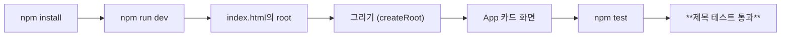

# project-setup 흐름

```mermaid
flowchart LR
  A[npm install] --> B[npm run dev]
  B --> C[index.html의 root]
  C --> D["그리기 (createRoot)"]
  D --> E[App 카드 화면]
  E --> F[npm test]
  F --> G[**제목 테스트 통과**]
```
