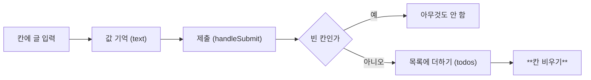

# todo-add 흐름

```mermaid
flowchart LR
  A[칸에 글 입력] --> B["값 기억 (text)"]
  B --> C["제출 (handleSubmit)"]
  C --> D{빈 칸인가}
  D -->|예| E[아무것도 안 함]
  D -->|아니오| F["목록에 더하기 (todos)"]
  F --> G[**칸 비우기**]
```
