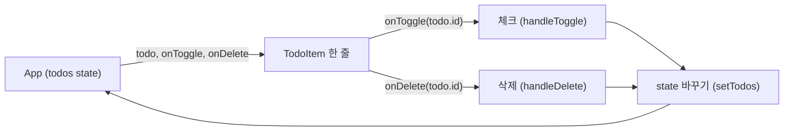

# todo-components 흐름

```mermaid
flowchart LR
  A["App (todos state)"] -->|"todo, onToggle, onDelete"| B[TodoItem 한 줄]
  B -->|"onToggle(todo.id)"| C["체크 (handleToggle)"]
  B -->|"onDelete(todo.id)"| D["삭제 (handleDelete)"]
  C --> E["state 바꾸기 (setTodos)"]
  D --> E
  E --> A
```
