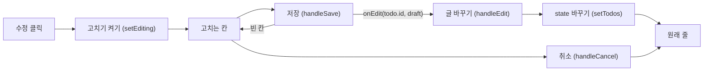

# todo-edit 흐름

```mermaid
flowchart LR
  A[수정 클릭] --> B["고치기 켜기 (setEditing)"]
  B --> C[고치는 칸]
  C --> D["저장 (handleSave)"]
  D -->|빈 칸| C
  D -->|"onEdit(todo.id, draft)"| E["글 바꾸기 (handleEdit)"]
  E --> F["state 바꾸기 (setTodos)"]
  F --> G[원래 줄]
  C --> H["취소 (handleCancel)"]
  H --> G
```
