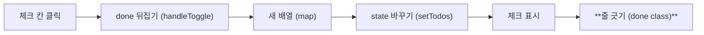

# todo-toggle 흐름

```mermaid
flowchart LR
  A[체크 칸 클릭] --> B["done 뒤집기 (handleToggle)"]
  B --> C["새 배열 (map)"]
  C --> D["state 바꾸기 (setTodos)"]
  D --> E[체크 표시]
  E --> F["**줄 긋기 (done class)**"]
```
