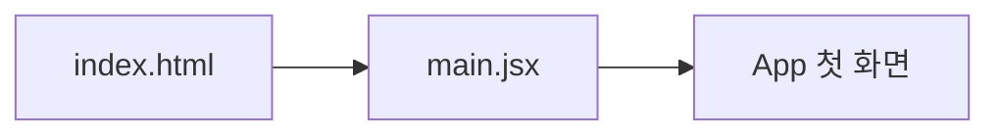

# 시나리오별 구조도

## 앱 열기

```mermaid
flowchart LR
  A[index.html] --> B[main.jsx]
  B --> C[App 첫 화면]
```

만든 장: project-setup
맡는 파일
- todo-app/index.html
- todo-app/src/main.jsx
- todo-app/src/App.jsx
- todo-app/src/index.css
